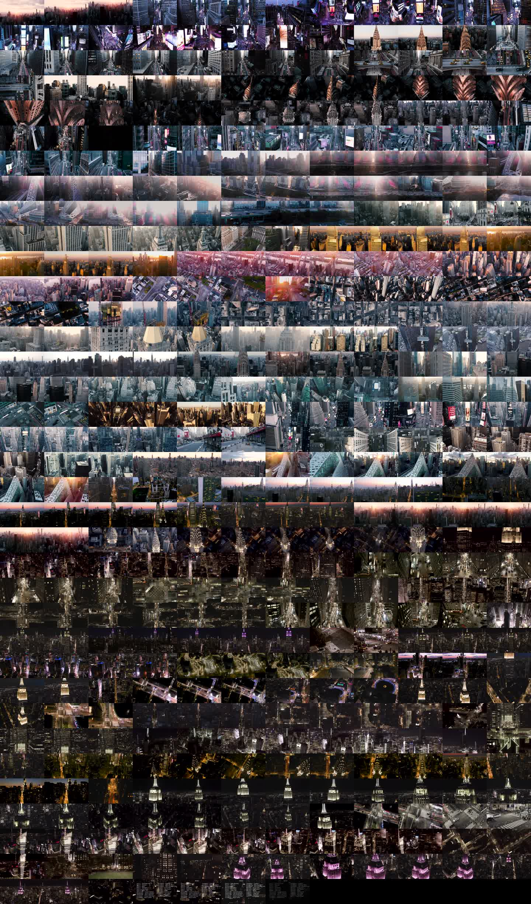

# Video splatter

Splat a video into a mosaic by sampling a frame at regular intervals. Useful
for seeing the changes over time of an entire video or movie.

## Installation

```
pip install videosplatter
```

## Usage
Command line:
```
$ python splat.py <filename> [--start <start time in seconds>] [--end <end time in seconds>] [--interval <number of seconds between samples]
```

Example:

```
$ python splat.py city.mp4
```

_Original from The Dronalist, used under CC-BY_


Programmatic usage:
```
from videosplatter import splat

splat.splat(filename, start_time, end_time, interval)
```